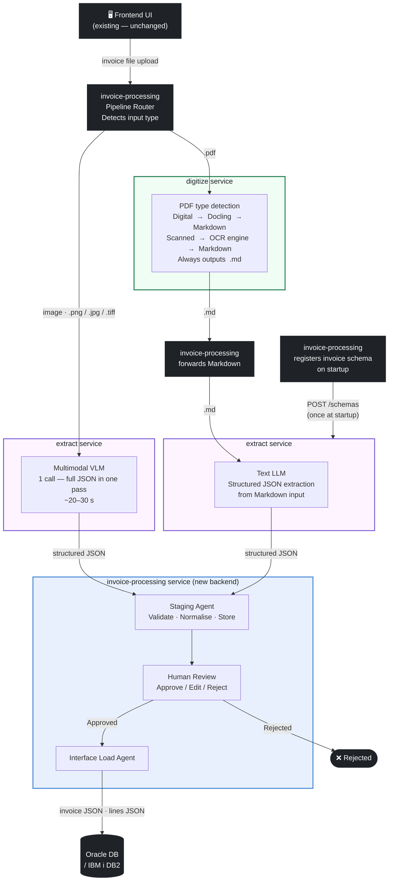

# Invoice Processing EBS → project-ai-services Onboarding Plan

> **Scope:** This plan covers **single-document invoice processing** only. Batch processing, user authentication/authorisation, and pipeline resume from mid-stage entrypoints are explicitly deferred — see the [Future Plan](#future-plan) section.

**Epic Goal:** Onboard the in-house Invoice Processing workflow into `project-ai-services` by introducing a new **invoice-processing** orchestration service and offloading document parsing + OCR to the existing `digitize` service and structured extraction to the existing `extract` service, while closing the capability gaps that block this integration.

### Responsibility split

| Service | Responsibility |
|---------|---------------|
| **`invoice-processing` UI** *(existing — reused as-is)* | Frontend web app; file upload, pipeline status, human review, interface viewer — **no changes required** |
| **`invoice-processing` backend** *(new — replaces existing backend entirely)* | E2E orchestration — pipeline routing (image vs PDF), calling digitize (PDF→MD) and extract, assembling output JSON, staging, review, and DB load |
| **`digitize`** | Receives any PDF file; internally detects digital vs scanned; routes to Docling (digital) or RapidOCR (scanned); always outputs **Markdown** |
| **`extract`** | Structured field extraction from `.txt` / `.md` files (text LLM) or image files (multimodal VLM); does **not** receive raw PDFs. **Model under consideration: `Ministral-3B-14b-instruct`** (used for both text and image extraction paths) |

- 📄 **PDF flow:** `invoice-processing` sends a PDF to `digitize`; `digitize` handles digital vs scanned detection internally and returns Markdown; `invoice-processing` forwards that Markdown to `extract`. The digital/scanned decision is entirely owned by `digitize` — `invoice-processing` does not need to know.

- 🖼️ **Image flow:** `invoice-processing` forwards image invoices (`.png`, `.jpg`, `.tiff`) directly to `extract` (VLM path) — `digitize` is not involved.

- ⚠️ **Deviation from original app:** The original invoice-processing application writes to **Oracle EBS** (`AP_INVOICES_INTERFACE` / `AP_INVOICE_LINES_INTERFACE`). This onboarding targets **Oracle DB / IBM i DB2** as the output database. All interface table names and connection configuration reflect this change.

---

## Decision Flow



---


## Gap Analysis

### Service: `digitize`

| # | Gap | Current State | Required |
|---|-----|--------------|----------|
| D-1 | **No OCR support + no PDF-type detection** | Parses `.pdf`/`.docx` via Docling native text layer only; no detection of scanned vs digital PDF; output is text/JSON chunks, not Markdown | Detect PDF type (≤50 ms); route scanned PDFs through an OCR engine (TesseractOCR or RapidOCR — TBD); ensure the final output is **Markdown** with structured table content (Docling natively supports MD output — this story ensures OCR output is also normalised to MD) |

> **Note:** Image format support (PNG, JPG, TIFF) in `digitize` is **not required** — image invoices bypass digitize entirely and go straight to `extract`.

---

### Service: `extract`

| # | Gap | Current State | Required |
|---|-----|--------------|----------|
| E-1 | **No image file input + no VLM path** | `ALLOWED_EXTENSIONS = {".txt", ".md"}` (`utils/job.py:41`); `validate_file_content` blocks binary files; `process_file` reads UTF-8 text only — no vision model call | Extend the async batch jobs endpoint (`POST /jobs`) to accept `.png`, `.jpg`, `.tiff` image uploads; add a VLM processing path that renders the image and calls the configured vision model; **PDFs are never passed to extract** |
| E-2 | **No VLM settings** | `settings.py` has no `vision_llm_endpoint` / `vision_llm_model` config | Add vision model configuration (`vision_llm_endpoint`, `vision_llm_model`) alongside existing LLM settings |
| E-3 | **No model validation** | No benchmark or accuracy comparison between candidate models | Run structured evaluation comparing **Granite Vision 4.1 4B**, **Ministral-3B-14b-instruct**, and **Mistral-Small-3.2-24B-Instruct-2506** on a sample invoice dataset; measure extraction accuracy (field-level F-score), inference speed (tokens/s, end-to-end latency), and cost per invoice; select and document the winning model |

> **Note:** `extract` does **not** handle PDFs — PDF→MD conversion is always done by `digitize` first. E-1 adds image support only. Routing is file-extension-based dispatch inside `process_file`, delivered as part of E-1. The synchronous file extraction endpoint is the responsibility of the new `invoice-processing` service.

---

### Service: `invoice-processing` *(new service)*

| # | Story | Description |
|---|-------|-------------|
| I-1 | **Service scaffold** | New FastAPI service with job model, DB schema, settings, health endpoint; registers invoice extraction schema with `extract` on startup |
| I-2 | **Pipeline router** | Single-stage routing: detect input type (image → One-Shot path; PDF → PDF path). No PDF-type detection in `invoice-processing` — that is owned by `digitize`. |
| I-3 | **PDF-Path orchestration** | PDF → send to `digitize` → receive Markdown back → forward Markdown to `extract` (text LLM) → assemble invoice JSON. Applies to all PDFs regardless of digital/scanned. |
| I-4 | **One-Shot orchestration** | Image invoice → call `extract` VLM endpoint directly → map result to invoice JSON |
| I-5 | **Invoice JSON output + API** | Unified output schema (`AP_INVOICES_ALL` + `AP_INVOICE_LINES_ALL`); job status + result endpoints |

---

## Stories

### Track D — `digitize` service

---

#### D-1 · PDF Type Detection + OCR Pipeline
**Priority:** High
**Can run in parallel with:** entire E-track and I-track

**What:** Two tightly coupled steps delivered together:
1. Add a fast (≤50 ms, no OCR) PDF-type classifier to `parsing/pdf.py` that returns `digital` (native text layer present) or `scanned` (image-only pages).
2. Integrate an OCR engine as a conditional branch in the conversion dispatcher: when `pdf_type == "scanned"`, run OCR and normalise the output to **Markdown** (matching the Docling MD output format) so that downstream consumers always receive consistent Markdown with structured table content.

> **OCR engine:** TesseractOCR and RapidOCR are both under evaluation — the final choice is TBD. The wrapper interface must be the same regardless of which engine is selected.

**Where:**
- `services/digitize/parsing/pdf.py` — new `detect_pdf_type(path) -> Literal["digital", "scanned"]`
- `services/digitize/parsing/ocr.py` *(new)* — OCR engine wrapper (TesseractOCR or RapidOCR)
- `services/digitize/workers/conversion_dispatcher.py` — conditional branch on PDF type

**Acceptance criteria:**
- Digital PDF → Docling → Markdown output with structured table content
- Scanned PDF → OCR engine → Markdown output in the same structure as Docling MD output
- Both paths produce `.md` output; no plain-text or JSON output emitted
- Classification completes in ≤50 ms for a 10-page document
- OCR is never invoked for digital PDFs (validated by test)
- Parallel OCR worker count configurable via settings
- Unit tests for classifier and OCR wrapper; integration test covering both branches

---

### Track E — `extract` service

---

#### E-1 · Image File Input + VLM Extraction Path
**Priority:** High
**Can run in parallel with:** entire D-track and I-1/I-2

**What:** Two tightly coupled capabilities delivered together:
1. Extend the existing async batch jobs endpoint (`POST /jobs`) to accept `.png`, `.jpg`, `.tiff` image uploads alongside the current `.txt`/`.md` files. Update `ALLOWED_EXTENSIONS`, `validate_file_extension`, and `validate_file_content` to handle binary image formats without breaking the existing text path. **PDF files are not added here** — PDFs are always converted to Markdown by `digitize` first.
2. Add a VLM processing branch inside `process_file`: when the staged file is an image, call the configured vision model (via `vision_llm_endpoint` / `vision_llm_model`); apply the same schema validation and return the same `JobResultResponse` shape as the text path.

**Where:**
- `services/extract/utils/job.py` — extend `ALLOWED_EXTENSIONS` with `.png`, `.jpg`, `.tiff`; update validation; add VLM branch in `process_file`
- `services/extract/utils/vision.py` *(new)* — image → VLM call logic
- `services/extract/settings.py` — add `vision_llm_endpoint`, `vision_llm_model`
- `services/extract/api/v1/jobs.py` — update OpenAPI description for `POST /jobs` to reflect new accepted image types

**Acceptance criteria:**
- `.png`, `.jpg`, `.tiff` uploads accepted by `POST /jobs`; staged and queued without error
- `.pdf` is explicitly **not** accepted by `extract` (rejected with 415)
- `.txt`/`.md` path fully unchanged (no regression)
- Image files are processed via VLM; result is schema-validated JSON
- Token usage correctly reported in `usage` block
- Returns 503 with clear message when vision endpoint is not configured
- Unit tests for each new image type, explicit PDF rejection, and VLM path (mocked); integration test with a sample invoice image

---

#### E-2 · Vision Model Configuration
**Priority:** High
**Depends on:** none (can land before E-1 as a pure settings change)
**Can run in parallel with:** E-1, all other tracks

**What:** Add `vision_llm_endpoint` and `vision_llm_model` settings to `settings.py`, following the same pattern as the existing `llm_endpoint`/`llm_model` settings. Include environment variable bindings and validation.

**Where:**
- `services/extract/settings.py`

**Acceptance criteria:**
- Settings load from env vars with sensible defaults / optional
- Missing vision endpoint is detectable at startup or at call time
- Unit tests for settings loading

---

#### E-3 · Model Validation
**Priority:** High
**Depends on:** E-2
**Can run in parallel with:** D-track, I-track

**What:** Run a structured benchmark comparing the three candidate models on a representative sample invoice dataset to select the model used for both text and image extraction paths.

**Models under evaluation:**
| Model | Type |
|-------|------|
| `Granite Vision 4.1 4B` | Multimodal (IBM) |
| `Ministral-3B-14b-instruct` | Multimodal (Mistral) |
| `Mistral-Small-3.2-24B-Instruct-2506` | Multimodal (Mistral) |

**Metrics:**
- **Accuracy** — field-level F-score on a labelled invoice set (header fields + line items)
- **Inference speed** — tokens/s and end-to-end latency per invoice
- **Cost** — estimated tokens per invoice across both paths (text + image)

**Where:**
- `test/model-validation/invoice/` *(new)* — evaluation scripts and labelled fixtures

**Acceptance criteria:**
- All three models evaluated on the same invoice sample set (≥10 invoices, mix of digital PDF, scanned PDF, image)
- Results documented in a comparison table with winning model clearly identified
- Selected model set as default in E-2 settings

---

### Track I — `invoice-processing` service *(new)*

---

#### I-1 · Service Scaffold
**Priority:** High — gates all I-track stories
**Can run in parallel with:** D-1, E-1, E-2

**What:** Scaffold the new `invoice-processing` FastAPI service: project structure, DB schema (job + document tables), settings, health endpoint, Containerfile, Makefile — matching the conventions of `digitize` and `extract`.

**Where:**
- `services/invoice-processing/` *(new directory)*

**Acceptance criteria:**
- Service starts and `/health` returns 200
- DB schema creates job and document tables
- Settings load from env vars
- Containerfile builds successfully
- Structure mirrors `digitize`/`extract` conventions
- On startup, `invoice-processing` registers the invoice extraction schema with `extract` via `POST /schemas`; startup fails with a clear error if registration does not succeed

---

#### I-2 · Pipeline Router
**Priority:** High
**Depends on:** I-1
**Can run in parallel with:** I-3, I-4 (after I-1)

**What:** Implement single-stage routing logic:
- Image formats (`.png`, `.jpg`, `.tiff`) → One-Shot path (forward directly to `extract` VLM endpoint)
- PDF files → PDF path (forward to `digitize`; do not attempt PDF-type detection here — `digitize` owns that decision internally)

**Acceptance criteria:**
- Image input → routed to One-Shot path
- PDF input → routed to PDF path (sent to `digitize` as-is)
- Routing decision logged at INFO level
- Unit tests for both branches (mocked downstream calls)

---

#### I-3 · PDF-Path Orchestration
**Priority:** High
**Depends on:** I-2, D-1
**Can run in parallel with:** I-4

**What:** Implement the PDF path: send any PDF (regardless of digital/scanned) to `digitize` → receive Markdown output → forward the Markdown to `extract` (text LLM) → map structured JSON result to invoice output. `invoice-processing` treats all PDFs identically; `digitize` owns the internal digital/scanned routing.

**Acceptance criteria:**
- PDF invoice sent to `digitize`; Markdown received back
- Markdown forwarded to `extract` text LLM endpoint
- Result mapped to `AP_INVOICES_ALL` + `AP_INVOICE_LINES_ALL`
- No PDF-type detection logic in `invoice-processing`
- Unit tests with mocked `digitize` and `extract` responses

---

#### I-4 · One-Shot Orchestration (~20% of traffic)
**Priority:** High
**Depends on:** I-2, E-1
**Can run in parallel with:** I-3

**What:** Implement the One-Shot path: forward image invoice (`.png`, `.jpg`, `.tiff`) directly to the `extract` VLM endpoint → receive schema-validated JSON → map to invoice JSON output.

**Acceptance criteria:**
- Image invoice forwarded directly to `extract` VLM endpoint with correct schema
- VLM result mapped to `AP_INVOICES_ALL` + `AP_INVOICE_LINES_ALL`
- Latency target ~20–30s tracked in job metadata
- Unit tests with mocked `extract` VLM response

---

#### I-5 · Invoice JSON Output & Job API
**Priority:** High
**Depends on:** I-3, I-4 (can start in parallel, finalised after)

**What:** Define and implement the unified invoice JSON output schema (`AP_INVOICES_ALL` + `AP_INVOICE_LINES_ALL`) and the public job API: submit invoice, poll status, retrieve result.

**Acceptance criteria:**
- Both paths (PDF-Path and One-Shot) produce identical invoice JSON structure
- `POST /invoices` accepts file upload + optional metadata; returns `job_id`
- `GET /invoices/{job_id}` returns job status and result
- OpenAPI docs complete
- Unit tests for output schema mapping

---

## Story Dependency Graph

```
D-1 (PDF type detect + OCR → MD output)   — independent, parallel with everything

E-2 (vision settings)                     — independent, parallel with everything
E-3 (model validation)                    — depends on E-2; parallel with D-track and I-track
E-1 (image input + VLM path)              — parallel with D-track

I-1 (scaffold)                            — registers invoice schema with extract on startup
  └── I-2 (router)
        ├── I-3 (PDF-Path)   needs D-1
        └── I-4 (One-Shot)   needs E-1
              └── I-5 (invoice output API)
```

**Parallel execution plan:**

| Sprint | D-track | E-track | I-track |
|--------|---------|---------|---------|
| 1 | D-1 | E-2 | I-1 |
| 2 | — | E-1 + E-3 | I-2 |
| 3 | — | — | I-3 + I-4 (parallel) |
| 4 | — | — | I-5 |

---

## Files to Change (Summary)

| Service | File | Story |
|---------|------|-------|
| digitize | `parsing/pdf.py` | D-1 |
| digitize | `parsing/ocr.py` *(new)* | D-1 |
| digitize | `workers/conversion_dispatcher.py` | D-1 |
| extract | `settings.py` | E-2 |
| extract | `utils/job.py` | E-1 (add `.png`/`.jpg`/`.tiff`; explicitly reject `.pdf`) |
| extract | `utils/vision.py` *(new)* | E-1 |
| extract | `api/v1/jobs.py` | E-1 |
| extract | `test/model-validation/invoice/` *(new)* | E-3 |
| invoice-processing | `services/invoice-processing/` *(new)* | I-1 through I-5 |

---

## Future Plan

The following features exist in the original invoice-processing application but are **explicitly out of scope** for this onboarding. They will be addressed in a follow-up phase once the single-document pipeline is stable.

| # | Feature | Notes |
|---|---------|-------|
| F-1 | **Batch document processing** | Submit multiple invoice files in a single job; track per-document status within the batch. Original app supports `POST /api/pipeline/submit-batch`. |
| F-2 | **User authentication / authorisation** | JWT-based auth, role checks (reviewer vs admin). The existing UI relies on the current `app-frontend` auth system; the new backend defers this entirely. |
| F-3 | **Pipeline resume from mid-stage entrypoints** | Ability to restart a job from Staging, Review, or Interface Load independently — e.g. `POST /api/pipeline/start-from-staging`, `start-from-review`, `start-from-load`. Not needed for the initial single-document happy path. |

---

*Review this document and confirm stories before JIRA creation.*
