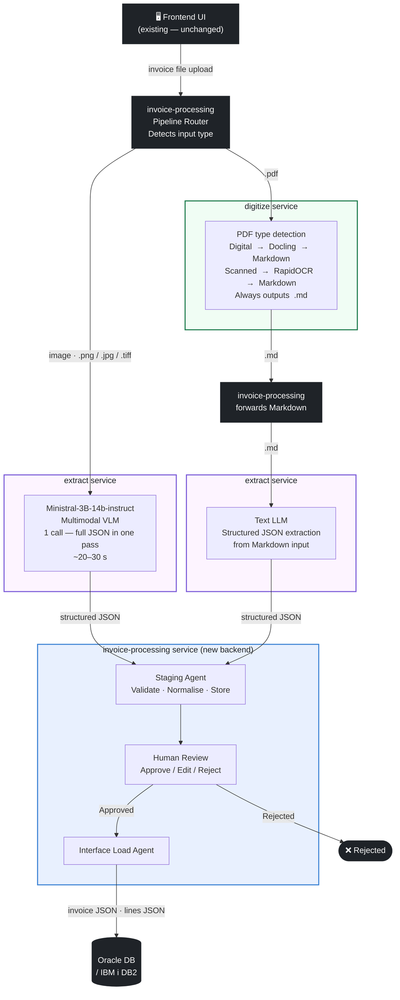

# Invoice Processing EBS → project-ai-services Onboarding Plan

**Epic Goal:** Onboard the in-house Invoice Processing workflow into `project-ai-services` by introducing a new **invoice-processing** orchestration service and offloading document parsing + OCR to the existing `digitize` service and structured extraction to the existing `extract` service, while closing the capability gaps that block this integration.

### Responsibility split

| Service | Responsibility |
|---------|---------------|
| **`invoice-processing` UI** *(existing — reused as-is)* | Frontend web app; file upload, pipeline status, human review, interface viewer — **no changes required** |
| **`invoice-processing` backend** *(new — replaces existing backend entirely)* | E2E orchestration — pipeline routing (image vs PDF), calling digitize (PDF→MD) and extract, assembling output JSON, staging, review, and DB load |
| **`digitize`** | Receives any PDF file; internally detects digital vs scanned; routes to Docling (digital) or RapidOCR (scanned); always outputs **Markdown** |
| **`extract`** | Structured field extraction from `.txt` / `.md` files (text LLM) or image files (Ministral-3B-14b-instruct VLM); does **not** receive raw PDFs |

> **PDF flow:** `invoice-processing` sends a PDF to `digitize`; `digitize` handles digital vs scanned detection internally and returns Markdown; `invoice-processing` forwards that Markdown to `extract`. The digital/scanned decision is entirely owned by `digitize` — `invoice-processing` does not need to know.
> **Image flow:** `invoice-processing` forwards image invoices (`.png`, `.jpg`, `.tiff`) directly to `extract` (VLM path) — `digitize` is not involved.

> ⚠️ **Deviation from original app:** The original invoice-processing application writes to **Oracle EBS** (`AP_INVOICES_INTERFACE` / `AP_INVOICE_LINES_INTERFACE`). This onboarding targets **Oracle DB / IBM i DB2** as the output database. All interface table names and connection configuration reflect this change.

---

## Decision Flow

> **UI note:** The existing frontend UI is reused as-is. Only the backend is being replaced.



---


## Gap Analysis

### Service: `digitize`

| # | Gap | Current State | Required |
|---|-----|--------------|----------|
| D-1 | **No OCR support + no PDF-type detection** | Parses `.pdf`/`.docx` via Docling native text layer only; no detection of scanned vs digital PDF; output is text/JSON chunks, not Markdown | Detect PDF type (≤50 ms); route scanned PDFs through RapidOCR; ensure the final output is **Markdown** with structured table content (Docling natively supports MD output — this story ensures OCR output is also normalised to MD) |

> **Note:** Image format support (PNG, JPG, TIFF) in `digitize` is **not required** — image invoices bypass digitize entirely and go straight to `extract`.

---

### Service: `extract`

| # | Gap | Current State | Required |
|---|-----|--------------|----------|
| E-1 | **No image file input + no VLM path** | `ALLOWED_EXTENSIONS = {".txt", ".md"}` (`utils/job.py:41`); `validate_file_content` blocks binary files; `process_file` reads UTF-8 text only — no vision model call | Extend the async batch jobs endpoint (`POST /jobs`) to accept `.png`, `.jpg`, `.tiff` image uploads; add a VLM processing path that renders the image and calls `Ministral-3B-14b-instruct`; **PDFs are never passed to extract** |
| E-2 | **No VLM settings** | `settings.py` has no `vision_llm_endpoint` / `vision_llm_model` config | Add `Ministral-3B-14b-instruct` vision model configuration (`vision_llm_endpoint`, `vision_llm_model`) alongside existing LLM settings |

> **Note:** `extract` does **not** handle PDFs — PDF→MD conversion is always done by `digitize` first. E-1 adds image support only. Routing is file-extension-based dispatch inside `process_file`, delivered as part of E-1. The synchronous file extraction endpoint is the responsibility of the new `invoice-processing` service.

---

### Service: `invoice-processing` *(new service)*

| # | Story | Description |
|---|-------|-------------|
| I-1 | **Service scaffold** | New FastAPI service with job model, DB schema, settings, health endpoint |
| I-2 | **Pipeline router** | Single-stage routing: detect input type (image → One-Shot path; PDF → PDF path). No PDF-type detection in `invoice-processing` — that is owned by `digitize`. |
| I-3 | **PDF-Path orchestration** | PDF → send to `digitize` → receive Markdown back → forward Markdown to `extract` (text LLM) → assemble invoice JSON. Applies to all PDFs regardless of digital/scanned. |
| I-4 | **One-Shot orchestration** | Image invoice → call `extract` VLM endpoint (`Ministral-3B-14b-instruct`) directly → map result to invoice JSON |
| I-5 | **Invoice JSON output + API** | Unified output schema (`AP_INVOICES_ALL` + `AP_INVOICE_LINES_ALL`); job status + result endpoints |

---

## Stories

### Track D — `digitize` service

---

#### D-1 · PDF Type Detection + OCR Pipeline (RapidOCR)
**Priority:** High  
**Can run in parallel with:** entire E-track and I-track

**What:** Two tightly coupled steps delivered together:
1. Add a fast (≤50 ms, no OCR) PDF-type classifier to `parsing/pdf.py` that returns `digital` (native text layer present) or `scanned` (image-only pages).
2. Integrate RapidOCR as a conditional branch in the conversion dispatcher: when `pdf_type == "scanned"`, run RapidOCR and normalise the output to **Markdown** (matching the Docling MD output format) so that downstream consumers always receive consistent Markdown with structured table content.

**Where:**
- `services/digitize/parsing/pdf.py` — new `detect_pdf_type(path) -> Literal["digital", "scanned"]`
- `services/digitize/parsing/ocr.py` *(new)* — RapidOCR wrapper
- `services/digitize/workers/conversion_dispatcher.py` — conditional branch on PDF type

**Acceptance criteria:**
- Digital PDF → Docling → Markdown output with structured table content
- Scanned PDF → RapidOCR → Markdown output in the same structure as Docling MD output
- Both paths produce `.md` output; no plain-text or JSON output emitted
- Classification completes in ≤50 ms for a 10-page document
- OCR is never invoked for digital PDFs (validated by test)
- Parallel OCR worker count configurable via settings
- Unit tests for classifier and OCR wrapper; integration test covering both branches

---

### Track E — `extract` service

---

#### E-1 · Image File Input + VLM Extraction Path
**Priority:** High
**Can run in parallel with:** entire D-track and I-1/I-2

**What:** Two tightly coupled capabilities delivered together:
1. Extend the existing async batch jobs endpoint (`POST /jobs`) to accept `.png`, `.jpg`, `.tiff` image uploads alongside the current `.txt`/`.md` files. Update `ALLOWED_EXTENSIONS`, `validate_file_extension`, and `validate_file_content` to handle binary image formats without breaking the existing text path. **PDF files are not added here** — PDFs are always converted to Markdown by `digitize` first.
2. Add a VLM processing branch inside `process_file`: when the staged file is an image, call **`Ministral-3B-14b-instruct`** (configured via `vision_llm_endpoint` / `vision_llm_model`); apply the same schema validation and return the same `JobResultResponse` shape as the text path.

**Where:**
- `services/extract/utils/job.py` — extend `ALLOWED_EXTENSIONS` with `.png`, `.jpg`, `.tiff`; update validation; add VLM branch in `process_file`
- `services/extract/utils/vision.py` *(new)* — image → VLM call logic
- `services/extract/settings.py` — add `vision_llm_endpoint`, `vision_llm_model`
- `services/extract/api/v1/jobs.py` — update OpenAPI description for `POST /jobs` to reflect new accepted image types

**Acceptance criteria:**
- `.png`, `.jpg`, `.tiff` uploads accepted by `POST /jobs`; staged and queued without error
- `.pdf` is explicitly **not** accepted by `extract` (rejected with 415)
- `.txt`/`.md` path fully unchanged (no regression)
- Image files are processed via VLM; result is schema-validated JSON
- Token usage correctly reported in `usage` block
- Returns 503 with clear message when vision endpoint is not configured
- Unit tests for each new image type, explicit PDF rejection, and VLM path (mocked); integration test with a sample invoice image

---

#### E-2 · Vision Model Configuration
**Priority:** High
**Depends on:** none (can land before E-1 as a pure settings change)
**Can run in parallel with:** E-1, all other tracks

**What:** Add `vision_llm_endpoint` and `vision_llm_model` settings to `settings.py` for **`Ministral-3B-14b-instruct`**, following the same pattern as the existing `llm_endpoint`/`llm_model` settings. Include environment variable bindings and validation.

**Where:**
- `services/extract/settings.py`

**Acceptance criteria:**
- Settings load from env vars with sensible defaults / optional
- Missing vision endpoint is detectable at startup or at call time
- Unit tests for settings loading

---

### Track I — `invoice-processing` service *(new)*

---

#### I-1 · Service Scaffold
**Priority:** High — gates all I-track stories  
**Can run in parallel with:** D-1, E-1, E-2

**What:** Scaffold the new `invoice-processing` FastAPI service: project structure, DB schema (job + document tables), settings, health endpoint, Containerfile, Makefile — matching the conventions of `digitize` and `extract`.

**Where:**
- `services/invoice-processing/` *(new directory)*

**Acceptance criteria:**
- Service starts and `/health` returns 200
- DB schema creates job and document tables
- Settings load from env vars
- Containerfile builds successfully
- Structure mirrors `digitize`/`extract` conventions

---

#### I-2 · Pipeline Router
**Priority:** High
**Depends on:** I-1
**Can run in parallel with:** I-3, I-4 (after I-1)

**What:** Implement single-stage routing logic:
- Image formats (`.png`, `.jpg`, `.tiff`) → One-Shot path (forward directly to `extract` VLM endpoint)
- PDF files → PDF path (forward to `digitize`; do not attempt PDF-type detection here — `digitize` owns that decision internally)

**Acceptance criteria:**
- Image input → routed to One-Shot path
- PDF input → routed to PDF path (sent to `digitize` as-is)
- Routing decision logged at INFO level
- Unit tests for both branches (mocked downstream calls)

---

#### I-3 · PDF-Path Orchestration
**Priority:** High
**Depends on:** I-2, D-1
**Can run in parallel with:** I-4

**What:** Implement the PDF path: send any PDF (regardless of digital/scanned) to `digitize` → receive Markdown output → forward the Markdown to `extract` (text LLM) → map structured JSON result to invoice output. `invoice-processing` treats all PDFs identically; `digitize` owns the internal digital/scanned routing.

**Acceptance criteria:**
- PDF invoice sent to `digitize`; Markdown received back
- Markdown forwarded to `extract` text LLM endpoint
- Result mapped to `AP_INVOICES_ALL` + `AP_INVOICE_LINES_ALL`
- No PDF-type detection logic in `invoice-processing`
- Unit tests with mocked `digitize` and `extract` responses

---

#### I-4 · One-Shot Orchestration (~20% of traffic)
**Priority:** High
**Depends on:** I-2, E-1
**Can run in parallel with:** I-3

**What:** Implement the One-Shot path: forward image invoice (`.png`, `.jpg`, `.tiff`) directly to the `extract` VLM endpoint (`Ministral-3B-14b-instruct`) → receive schema-validated JSON → map to invoice JSON output.

**Acceptance criteria:**
- Image invoice forwarded directly to `extract` VLM endpoint with correct schema
- VLM result mapped to `AP_INVOICES_ALL` + `AP_INVOICE_LINES_ALL`
- Latency target ~20–30s tracked in job metadata
- Unit tests with mocked `extract` VLM response

---

#### I-5 · Invoice JSON Output & Job API
**Priority:** High
**Depends on:** I-3, I-4 (can start in parallel, finalised after)

**What:** Define and implement the unified invoice JSON output schema (`AP_INVOICES_ALL` + `AP_INVOICE_LINES_ALL`) and the public job API: submit invoice, poll status, retrieve result.

**Acceptance criteria:**
- Both paths (PDF-Path and One-Shot) produce identical invoice JSON structure
- `POST /invoices` accepts file upload + optional metadata; returns `job_id`
- `GET /invoices/{job_id}` returns job status and result
- OpenAPI docs complete
- Unit tests for output schema mapping

---

## Story Dependency Graph

```
D-1 (PDF type detect + OCR → MD output)   — independent, parallel with everything

E-2 (vision settings)                     — independent, parallel with everything
E-1 (image input + VLM path)              — parallel with D-track

I-1 (scaffold)
  └── I-2 (router)
        ├── I-3 (PDF-Path)   needs D-1
        └── I-4 (One-Shot)   needs E-1
              └── I-5 (invoice output API)
```

**Parallel execution plan:**

| Sprint | D-track | E-track | I-track |
|--------|---------|---------|---------|
| 1 | D-1 | E-2 | I-1 |
| 2 | — | E-1 | I-2 |
| 3 | — | — | I-3 + I-4 (parallel) |
| 4 | — | — | I-5 |

---

## Files to Change (Summary)

| Service | File | Story |
|---------|------|-------|
| digitize | `parsing/pdf.py` | D-1 |
| digitize | `parsing/ocr.py` *(new)* | D-1 |
| digitize | `workers/conversion_dispatcher.py` | D-1 |
| extract | `settings.py` | E-2 |
| extract | `utils/job.py` | E-1 (add `.png`/`.jpg`/`.tiff`; explicitly reject `.pdf`) |
| extract | `utils/vision.py` *(new)* | E-1 |
| extract | `api/v1/jobs.py` | E-1 |
| invoice-processing | `services/invoice-processing/` *(new)* | I-1 through I-6 |

---

## API Contract — `invoice-processing` Service

The existing UI (`app-frontend`) calls a FastAPI backend via the `/api/*` prefix. The new `invoice-processing` service must expose the **same URL structure and response shapes** so the frontend works without changes.

The existing backend is split across three logical areas: **Pipeline**, **Review**, and **Config/Interface**. All are reproduced below.

---

### Auth API (`/api/auth`)

Auth remains in the existing `app-frontend` backend and is **out of scope** for the new service. The new service only needs to accept and validate the JWT Bearer token issued by the existing auth system.

---

### Pipeline API (`/api/pipeline`)

#### `POST /api/pipeline/submit`
Submit a single invoice file for full pipeline processing.

**Request:** `multipart/form-data`
| Field | Type | Required | Notes |
|-------|------|----------|-------|
| `file` | binary | ✓ | PDF, PNG, JPG, JPEG, TIFF, TIF, WEBP, BMP |
| `notify_email` | string | — | Optional email for completion notification |

**Response 202:**
```json
{ "job_id": "<uuid>", "status": "INGESTED", "message": "Pipeline started." }
```

---

#### `POST /api/pipeline/submit-batch`
Submit multiple invoice files as a batch. Supports chunked upload — pass `batch_id` from the first chunk response to subsequent chunks to append to the same batch.

**Request:** `multipart/form-data`
| Field | Type | Required | Notes |
|-------|------|----------|-------|
| `files` | binary[] | ✓ | One or more invoice files |
| `notify_email` | string | — | Optional notification email |
| `batch_id` | string | — | Omit for first chunk; pass returned `batch_id` for subsequent chunks |

**Response 202:**
```json
{
  "batch_id": "<uuid>",
  "batch_num": 3,
  "batch_label": "BATCH-3",
  "file_count": 4,
  "status": "INGESTED",
  "message": "Batch pipeline started."
}
```

---

#### `POST /api/pipeline/start-from-staging`
Skip document upload and OCR. Upload a pre-extracted JSON payload directly and jump into the Staging phase.

**Request:** `multipart/form-data`
| Field | Type | Required | Notes |
|-------|------|----------|-------|
| `file` | binary | ✓ | `.json` file with shape `{ "invoice": {}, "lines": [] }` or `{ "AP_INVOICES_ALL": {}, "AP_INVOICE_LINES_ALL": [] }` |

**Response 202:**
```json
{ "job_id": "<uuid>", "status": "EXTRACTED", "message": "Staging started from uploaded JSON." }
```

---

#### `POST /api/pipeline/start-from-review`
Re-queue a `STAGED` or `REJECTED` job for human review without re-running staging.

**Request:** `multipart/form-data`
| Field | Type | Required |
|-------|------|----------|
| `job_id` | string | ✓ |

**Response 200:**
```json
{ "job_id": "<uuid>", "message": "Job queued for review." }
```

---

#### `POST /api/pipeline/start-from-load`
Trigger the interface load phase directly for an `APPROVED` job (retry on load failure).

**Request:** `multipart/form-data`
| Field | Type | Required |
|-------|------|----------|
| `job_id` | string | ✓ |

**Response 200:**
```json
{ "job_id": "<uuid>", "message": "Interface load triggered." }
```

---

#### `GET /api/pipeline/jobs`
Return all pipeline jobs ordered by most recent first.

**Response 200:** Array of job objects:
```json
[
  {
    "job_id": "<uuid>", "file_name": "invoice.pdf", "file_path": "...",
    "status": "PENDING_REVIEW", "batch_id": null, "notify_email": null,
    "error_message": null, "created_at": "...", "updated_at": "..."
  }
]
```

**Job status values:**
`INGESTED` → `EXTRACTING` → `EXTRACTED` → `STAGING` → `STAGED` → `PENDING_REVIEW` → `APPROVED` / `REJECTED` → `LOADING` → `LOADED` / `FAILED`

Batch-level statuses: `BATCH_EXTRACTING`, `BATCH_STAGING`, `BATCH_COMPLETE`

---

#### `GET /api/pipeline/{job_id}`
Return status and summary for a single job.

**Response 200:** Same shape as a single element from `GET /api/pipeline/jobs`.
**Response 404:** Job not found.

---

#### `GET /api/pipeline/{job_id}/invoice-file`
Stream the original uploaded invoice file for in-browser viewing.

**Response 200:** Binary file stream (`inline` content-disposition). MIME type auto-detected.
**Response 404:** Job or file not found.

---

#### `GET /api/pipeline/batches`
Return all batches with their child job lists, most recent first.

**Response 200:**
```json
[
  {
    "batch_id": "<uuid>", "batch_num": 3, "batch_label": "BATCH-3",
    "file_count": 4,
    "sentinel": { <pipeline_jobs row for the batch> },
    "children": [ { <pipeline_jobs row> }, ... ]
  }
]
```

---

#### `GET /api/pipeline/batches/{batch_num_or_id}`
Return a single batch by integer `batch_num` (e.g. `"3"`) or UUID `batch_id`.

**Response 200:** Same shape as a single element from `GET /api/pipeline/batches`.
**Response 404:** Batch not found.

---

### Review API (`/api/review`)

#### `GET /api/review/{job_id}`
Return staging header + lines + summary counts for human review.

**Response 200:**
```json
{
  "header": { "stg_id": 1, "VENDOR_NAME": "...", ... },
  "lines":  [ { "stg_line_id": 1, "LINE_NUMBER": 1, "status": "PENDING", ... } ],
  "summary": { "total": 5, "approved": 0, "excluded": 0, "pending": 5 }
}
```

---

#### `PUT /api/review/{job_id}/header`
Update a single header field in staging.

**Request body:**
```json
{ "field": "VENDOR_NAME", "value": "Acme Corp" }
```
**Response 200:** `{ "message": "Field 'VENDOR_NAME' updated successfully." }`

---

#### `PUT /api/review/{job_id}/line/{stg_line_id}`
Update a single editable field on a line.

**Request body:**
```json
{ "field": "AMOUNT", "value": 123.45 }
```
**Response 200:** `{ "message": "Line field 'AMOUNT' updated for line 1." }`

---

#### `PUT /api/review/{job_id}/line/{stg_line_id}/status`
Set a single line's status.

**Request body:**
```json
{ "status": "APPROVED" }   // APPROVED | EXCLUDED | PENDING
```

---

#### `PUT /api/review/{job_id}/lines/status`
Bulk-set ALL lines for this job.

**Request body:**
```json
{ "status": "APPROVED" }
```
**Response 200:** `{ "message": "5 lines set to APPROVED.", "count": 5 }`

---

#### `POST /api/review/{job_id}/approve`
Approve the staged invoice. Triggers Interface Load in the background.

**Request body:**
```json
{ "reviewed_by": "reviewer" }
```
**Response 200:**
```json
{ "message": "Job <id> approved.", "job_id": "<uuid>", "approved_lines": 4, "excluded_lines": 1 }
```

---

#### `POST /api/review/{job_id}/reject`
Reject the staged invoice with a reason.

**Request body:**
```json
{ "reason": "Duplicate invoice", "reviewed_by": "reviewer" }
```
**Response 200:** `{ "message": "Job <id> rejected.", "reason": "Duplicate invoice" }`

---

### Config API (`/api/config`)

#### `GET /api/config/oracle/status`
Return current Oracle DB / IBM i DB2 connection status (no credentials exposed).

> ⚠️ **Deviation:** Original app connected to Oracle EBS. This service targets Oracle DB or IBM i DB2.

**Response 200:**
```json
{ "configured": true, "host": "...", "port": "1521", "service": "...", "user": "...", "wallet_configured": false }
```

---

#### `POST /api/config/oracle/connect`
Persist database credentials and test the connection.

**Request body:**
```json
{ "host": "...", "port": 1521, "service_name": "PROD", "sid": "", "username": "apps", "password": "...", "client_dir": "", "wallet_dir": "", "wallet_password": "" }
```
**Response 200:** `{ "message": "...", "oracle_version": "...", "host": "...", "user": "..." }`
**Response 502:** Connection test failed.

---

#### `POST /api/config/oracle/test`
Test the currently configured connection.

---

#### `DELETE /api/config/oracle`
Clear stored database credentials.

---

#### `GET /api/config/oracle/sources`
Return invoice source lookup values from the target database (or fallback list).

**Response 200:** `{ "sources": [{ "code": "MANUAL INVOICE ENTRY", "meaning": "Manual Invoice Entry" }], "from_db": true }`

---

#### `GET /api/config/oracle/line-types`
Return invoice line type lookup codes from the target database (or fallback list).

**Response 200:** `{ "line_types": ["ITEM", "FREIGHT", "TAX", ...], "from_db": true }`

---

### Interface API (`/api/interface`)

#### `GET /api/interface/invoices`
Return all stored invoice records, most recent first. Uses real Oracle DB / IBM i DB2 tables when configured, SQLite mirror otherwise.

> ⚠️ **Deviation:** Original app read from `AP_INVOICES_INTERFACE` in Oracle EBS. This service reads from the equivalent table in Oracle DB / IBM i DB2.

---

#### `GET /api/interface/invoices/{invoice_id}`
Return a single interface invoice with its lines.

**Response 200:**
```json
{ "header": { "invoice_id": 1001, ... }, "lines": [ { "line_number": 1, ... } ] }
```

---

### Logs API (`/api/logs`)

#### `GET /api/logs`
Return tail of the application log.

**Query params:** `lines` (default 200), `level` (e.g. `ERROR`), `job_id` (filter by job).

---

## I-6 Story Update — API Surface

Story I-6 must implement **all of the above endpoints** to ensure the existing UI works without modification. The Oracle DB / IBM i DB2 config and Interface APIs may delegate to the existing `app-frontend` backend or be re-implemented in the new service — this is a deployment decision to be confirmed during I-1 scaffolding.

---

*Review this document and confirm stories before JIRA creation.*
