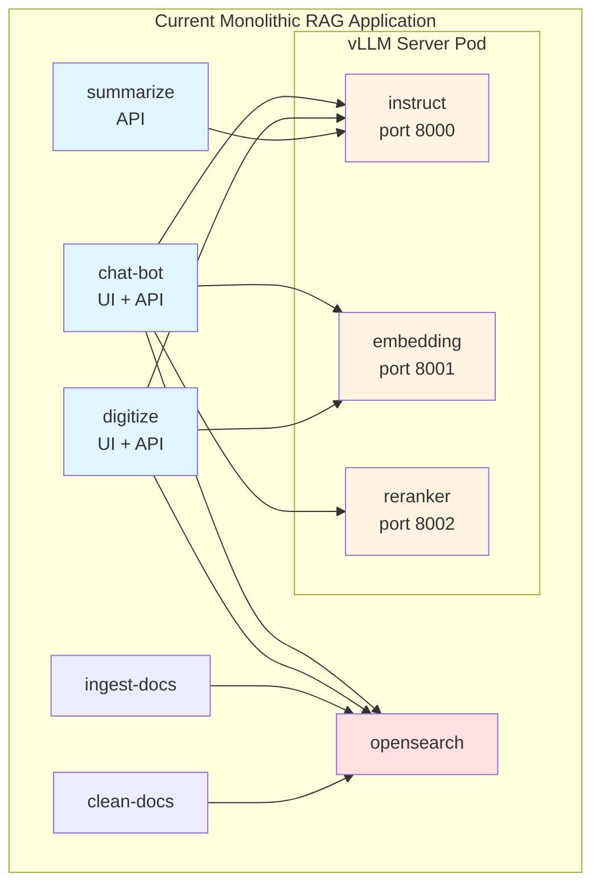
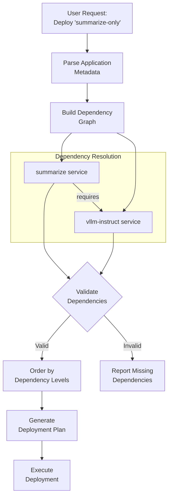

# Design Proposal: Modular Service Deployment Architecture

**Subject:** Flexible Individual Service Deployment for AI Services

**Target Platform:** RHEL LPAR (Podman) / OpenShift (Kubernetes)

**Status:** Draft / Proposal

---

## 1. Executive Summary

The **Modular Service Deployment Architecture** transforms the current monolithic RAG application deployment into a flexible, composable system where users can deploy individual services (e.g., summarize-only, digitize-only) with only their required dependencies. This architecture eliminates unnecessary resource consumption by allowing selective deployment of microservices while maintaining backward compatibility with existing full-stack deployments.

Currently, deploying any service (chatbot, digitize, or summarize) requires deploying the entire stack including vLLM (with all three models: instruct, embedding, reranker) and OpenSearch, even when only a subset is needed. For example, the summarize service only requires the vLLM instruct model, yet the current architecture forces deployment of embedding, reranker models, and OpenSearch unnecessarily.

## 2. Current Architecture Analysis

### 2.1 Existing Application Structure

The system currently has three monolithic application variants:
- **rag** - Production RAG application (OpenShift + Podman)
- **rag-cpu** - CPU-only variant (Podman only)
- **rag-dev** - Development variant (OpenShift + Podman)

### 2.2 Current Service Dependencies



### 2.3 Service Dependency Matrix

| Service | vLLM Instruct | vLLM Embedding | vLLM Reranker | OpenSearch |
|---------|---------------|----------------|---------------|------------|
| **summarize** | ✅ Required | ❌ Not needed | ❌ Not needed | ❌ Not needed |
| **digitize** | ✅ Required | ✅ Required | ❌ Not needed | ✅ Required |
| **chatbot** | ✅ Required | ✅ Required | ✅ Required | ✅ Required |
| **ingest-docs** | ❌ Not needed | ❌ Not needed | ❌ Not needed | ✅ Required |
| **clean-docs** | ❌ Not needed | ❌ Not needed | ❌ Not needed | ✅ Required |

### 2.4 Current Deployment Model

```yaml
# Current: ai-services/assets/applications/rag-dev/podman/metadata.yaml
podTemplateExecutions:
  - [opensearch.yaml.tmpl, vllm-server.yaml.tmpl]
  - [clean-docs.yaml.tmpl]
  - [ingest-docs.yaml.tmpl, digitize.yaml.tmpl, summarize-api.yaml.tmpl, chat-bot.yaml.tmpl]
```

**Problem:** All services are deployed together in fixed groups, with no flexibility to deploy individual services with only their required dependencies.

---

## 3. Proposed Architecture

### 3.1 Service-Based Directory Structure

Transform from application-centric to service-centric organization:

```
ai-services/assets/
├── services/                    # Individual service definitions
│   ├── vllm-instruct/
│   │   ├── metadata.yaml
│   │   ├── podman/
│   │   │   └── templates/
│   │   │       └── vllm-instruct.yaml.tmpl
│   │   └── openshift/
│   │       └── templates/
│   │           └── instruct-inferenceservice.yaml
│   ├── vllm-embedding/
│   │   ├── metadata.yaml
│   │   └── podman/templates/vllm-embedding.yaml.tmpl
│   ├── vllm-reranker/
│   │   ├── metadata.yaml
│   │   └── podman/templates/vllm-reranker.yaml.tmpl
│   ├── opensearch/
│   │   ├── metadata.yaml
│   │   └── podman/templates/opensearch.yaml.tmpl
│   ├── chatbot/
│   │   ├── metadata.yaml
│   │   └── podman/templates/chat-bot.yaml.tmpl
│   ├── digitize/
│   │   ├── metadata.yaml
│   │   └── podman/templates/digitize.yaml.tmpl
│   ├── summarize/
│   │   ├── metadata.yaml
│   │   └── podman/templates/summarize-api.yaml.tmpl
│   ├── ingest/
│   │   ├── metadata.yaml
│   │   └── podman/templates/ingest-docs.yaml.tmpl
│   └── cleanup/
│       ├── metadata.yaml
│       └── podman/templates/clean-docs.yaml.tmpl
│
└── applications/                # Pre-configured application profiles
    ├── rag-full/               # Complete RAG stack (backward compatible)
    │   ├── metadata.yaml
    │   └── podman/
    │       └── values.yaml
    ├── summarize-only/         # Minimal summarization service
    │   ├── metadata.yaml
    │   └── podman/values.yaml
    ├── digitize-only/          # Document digitization service
    │   ├── metadata.yaml
    │   └── podman/values.yaml
    └── chatbot-only/           # Full chatbot with RAG
        ├── metadata.yaml
        └── podman/values.yaml
```

### 3.2 Service Metadata Schema

Each service defines its dependencies, resources, and configuration:

```yaml
# services/summarize/metadata.yaml
name: summarize
version: 1.0.0
type: service
description: "Document summarization service using LLM"

dependencies:
  required:
    - service: vllm-instruct
      version: ">=1.0.0"
      reason: "Required for text generation and summarization"
  optional: []

resources:
  memory: "1Gi"
  cpu: "1"

ports:
  - name: api
    container: 6000
    host: auto
    description: "Summarization API endpoint"

healthcheck:
  path: /health
  port: 6000
  initialDelay: 10s
  period: 30s

configuration:
  env:
    - name: LLM_ENDPOINT
      required: true
      default: "http://{{.AppName}}--vllm-instruct:8000"
      description: "vLLM instruct model endpoint"
    - name: LLM_MODEL
      required: true
      default: "ibm-granite/granite-3.3-8b-instruct"
      description: "Model identifier for summarization"
    - name: LOG_LEVEL
      required: false
      default: "INFO"
      description: "Logging level"

tags:
  - nlp
  - summarization
  - api
```

```yaml
# services/vllm-instruct/metadata.yaml
name: vllm-instruct
version: 1.0.0
type: service
description: "vLLM inference server for instruct models"

dependencies:
  required: []
  optional: []

resources:
  memory: "150Gi"
  devices:
    - type: "podman.io/device"
      path: "/dev/vfio"
      count: 4

ports:
  - name: inference
    container: 8000
    host: none
    description: "OpenAI-compatible inference endpoint"

healthcheck:
  path: /health
  port: 8000
  initialDelay: 420s
  period: 30s

configuration:
  env:
    - name: VLLM_MODEL_PATH
      required: true
      default: "/models/ibm-granite/granite-3.3-8b-instruct"
    - name: AIU_WORLD_SIZE
      required: true
      default: "4"
    - name: MAX_MODEL_LEN
      required: true
      default: "32768"

models:
  - name: "ibm-granite/granite-3.3-8b-instruct"
    required: true

tags:
  - llm
  - inference
  - vllm
```

```yaml
# services/opensearch/metadata.yaml
name: opensearch
version: 1.0.0
type: service
description: "Vector database for document storage and retrieval"

dependencies:
  required: []
  optional: []

resources:
  memory: "8Gi"
  storage:
    - name: data
      size: "50Gi"
      path: "/usr/share/opensearch/data"

ports:
  - name: client
    container: 9200
    host: none
  - name: metrics
    container: 9600
    host: none

healthcheck:
  type: exec
  command: ["curl", "-k", "-u", "admin:${OPENSEARCH_INITIAL_ADMIN_PASSWORD}", "https://localhost:9200/_cluster/health"]
  initialDelay: 60s
  period: 30s

configuration:
  env:
    - name: OPENSEARCH_INITIAL_ADMIN_PASSWORD
      required: true
      default: "AiServices@12345"
      description: "Admin password for OpenSearch"
    - name: OPENSEARCH_JAVA_OPTS
      required: false
      default: "-Xms4g -Xmx4g"

tags:
  - database
  - vector-db
  - search
```

### 3.3 Application Profile Schema

Application profiles define service compositions:

```yaml
# applications/summarize-only/metadata.yaml
name: summarize-only
version: 1.0.0
type: application
description: "Standalone document summarization service"

services:
  - name: vllm-instruct
    enabled: true
    config:
      env:
        MAX_MODEL_LEN: "32768"
  - name: summarize
    enabled: true
    config:
      env:
        LOG_LEVEL: "INFO"

deployment:
  strategy: sequential
  groups:
    - [vllm-instruct]      # Deploy infrastructure first
    - [summarize]          # Deploy application services

validation:
  required_services: [vllm-instruct, summarize]
  
tags:
  - minimal
  - summarization
```

```yaml
# applications/digitize-only/metadata.yaml
name: digitize-only
version: 1.0.0
type: application
description: "Document digitization and ingestion service"

services:
  - name: vllm-instruct
    enabled: true
  - name: vllm-embedding
    enabled: true
  - name: opensearch
    enabled: true
  - name: digitize
    enabled: true
  - name: ingest
    enabled: true
  - name: cleanup
    enabled: true

deployment:
  strategy: sequential
  groups:
    - [opensearch, vllm-instruct, vllm-embedding]
    - [cleanup]
    - [ingest, digitize]

validation:
  required_services: [vllm-instruct, vllm-embedding, opensearch, digitize]

tags:
  - digitization
  - ingestion
```

```yaml
# applications/rag-full/metadata.yaml (backward compatible)
name: rag-full
version: 1.0.0
type: application
description: "Complete RAG application with all services"

services:
  - name: vllm-instruct
    enabled: true
  - name: vllm-embedding
    enabled: true
  - name: vllm-reranker
    enabled: true
  - name: opensearch
    enabled: true
  - name: chatbot
    enabled: true
  - name: digitize
    enabled: true
  - name: summarize
    enabled: true
  - name: ingest
    enabled: true
  - name: cleanup
    enabled: true

deployment:
  strategy: sequential
  groups:
    - [opensearch, vllm-instruct, vllm-embedding, vllm-reranker]
    - [cleanup]
    - [ingest, digitize, summarize, chatbot]

validation:
  required_services: [vllm-instruct, vllm-embedding, vllm-reranker, opensearch, chatbot]

tags:
  - full-stack
  - rag
  - production
```

---

## 4. Dependency Resolution System

### 4.1 Dependency Graph Construction



### 4.2 Dependency Resolution Algorithm

```go
// Pseudocode for dependency resolution
func ResolveServiceDependencies(appProfile ApplicationProfile) ([]Service, error) {
    // 1. Build service registry
    serviceRegistry := LoadAllServices()
    
    // 2. Initialize dependency graph
    graph := NewDependencyGraph()
    visited := make(map[string]bool)
    
    // 3. For each enabled service in profile
    for _, svc := range appProfile.Services {
        if !svc.Enabled {
            continue
        }
        
        // 4. Recursively resolve dependencies
        if err := resolveDependencies(svc.Name, graph, serviceRegistry, visited); err != nil {
            return nil, err
        }
    }
    
    // 5. Detect circular dependencies
    if graph.HasCycle() {
        return nil, errors.New("circular dependency detected")
    }
    
    // 6. Topological sort for deployment order
    orderedServices := graph.TopologicalSort()
    
    return orderedServices, nil
}

func resolveDependencies(serviceName string, graph *DependencyGraph, 
                        registry ServiceRegistry, visited map[string]bool) error {
    if visited[serviceName] {
        return nil
    }
    
    service := registry.Get(serviceName)
    if service == nil {
        return fmt.Errorf("service not found: %s", serviceName)
    }
    
    visited[serviceName] = true
    graph.AddNode(service)
    
    // Resolve required dependencies
    for _, dep := range service.Dependencies.Required {
        if err := resolveDependencies(dep.Service, graph, registry, visited); err != nil {
            return err
        }
        graph.AddEdge(serviceName, dep.Service)
    }
    
    return nil
}
```

### 4.3 Deployment Ordering

Services are deployed in dependency order:

```
Level 0 (Infrastructure):
  - opensearch
  - vllm-instruct
  - vllm-embedding
  - vllm-reranker

Level 1 (Utilities):
  - cleanup
  - ingest

Level 2 (Applications):
  - summarize
  - digitize
  - chatbot
```

---

## 5. CLI Enhancement

### 5.1 New CLI Commands

```bash
# List available services
$ ai-services service list
Available Services:
  vllm-instruct    - vLLM inference server for instruct models
  vllm-embedding   - vLLM inference server for embedding models
  vllm-reranker    - vLLM inference server for reranker models
  opensearch       - Vector database for document storage
  chatbot          - RAG chatbot with UI
  digitize         - Document digitization service
  summarize        - Document summarization service
  ingest           - Document ingestion utility
  cleanup          - Database cleanup utility

# Show service details
$ ai-services service info summarize
Service: summarize
Version: 1.0.0
Description: Document summarization service using LLM

Dependencies:
  Required:
    - vllm-instruct (>=1.0.0): Required for text generation

Resources:
  Memory: 1Gi
  CPU: 1

Ports:
  - api (6000): Summarization API endpoint

Tags: nlp, summarization, api

# List available application profiles
$ ai-services application list-profiles
Available Application Profiles:
  rag-full         - Complete RAG application with all services
  summarize-only   - Standalone document summarization service
  digitize-only    - Document digitization and ingestion service
  chatbot-only     - Full chatbot with RAG capabilities

# Create application from profile
$ ai-services application create my-summarizer --profile=summarize-only

Resolving dependencies...
✓ vllm-instruct (required by summarize)
✓ summarize

Deployment plan:
  Group 1: vllm-instruct
  Group 2: summarize

Proceed with deployment? [y/N]: y

Deploying vllm-instruct...
Deploying summarize...

Application 'my-summarizer' created successfully!
Services:
  - vllm-instruct: http://localhost:8000
  - summarize: http://localhost:6000

# Create application with custom services
$ ai-services application create my-app \
    --services=summarize,vllm-instruct \
    --set summarize.env.LOG_LEVEL=DEBUG

# Interactive service selection
$ ai-services application create my-app --interactive

Select services to deploy:
  [x] vllm-instruct
  [ ] vllm-embedding
  [ ] vllm-reranker
  [ ] opensearch
  [ ] chatbot
  [ ] digitize
  [x] summarize
  [ ] ingest
  [ ] cleanup

Analyzing dependencies...
✓ All required dependencies satisfied

Continue? [y/N]: y
```

### 5.2 Updated Create Command

```go
// Enhanced create command with service selection
var createCmd = &cobra.Command{
    Use:   "create [name]",
    Short: "Deploy an application with selected services",
    Long: `Deploy an application with custom service selection or from a profile.
    
Examples:
  # Deploy from profile
  ai-services application create my-app --profile=summarize-only
  
  # Deploy with specific services
  ai-services application create my-app --services=summarize,vllm-instruct
  
  # Interactive selection
  ai-services application create my-app --interactive
`,
    Args: cobra.ExactArgs(1),
    RunE: func(cmd *cobra.Command, args []string) error {
        appName := args[0]
        
        var services []string
        
        // Determine service selection method
        if profileName != "" {
            // Load from profile
            profile, err := LoadApplicationProfile(profileName)
            if err != nil {
                return err
            }
            services = profile.GetEnabledServices()
        } else if len(selectedServices) > 0 {
            // Use explicitly selected services
            services = selectedServices
        } else if interactive {
            // Interactive selection
            services, err = InteractiveServiceSelection()
            if err != nil {
                return err
            }
        } else {
            return errors.New("must specify --profile, --services, or --interactive")
        }
        
        // Resolve dependencies
        resolver := NewDependencyResolver()
        deploymentPlan, err := resolver.Resolve(services)
        if err != nil {
            return fmt.Errorf("dependency resolution failed: %w", err)
        }
        
        // Display plan and confirm
        deploymentPlan.Display()
        if !autoApprove {
            if !ConfirmDeployment() {
                return errors.New("deployment cancelled")
            }
        }
        
        // Execute deployment
        return ExecuteDeployment(appName, deploymentPlan)
    },
}
```

---

## 6. Migration Strategy

### 6.1 Phase 1: Service Extraction (Weeks 1-2)

**Goal:** Extract individual services while maintaining backward compatibility

**Tasks:**
1. Create `services/` directory structure
2. Extract each microservice into individual service definitions
3. Create service metadata files with dependency information
4. Split monolithic vLLM pod into separate service definitions
5. Maintain existing `applications/rag*` as-is for backward compatibility

**Deliverables:**
- Service definitions for all 9 services
- Service metadata with dependencies
- Unit tests for service loading

### 6.2 Phase 2: Dependency Management (Weeks 3-4)

**Goal:** Implement dependency resolution system

**Tasks:**
1. Implement dependency graph construction
2. Add circular dependency detection
3. Create topological sort for deployment ordering
4. Add dependency validation
5. Implement service registry

**Deliverables:**
- Dependency resolver implementation
- Validation framework
- Integration tests for dependency resolution

### 6.3 Phase 3: CLI Enhancement (Weeks 5-6)

**Goal:** Add service selection capabilities to CLI

**Tasks:**
1. Add `service list` and `service info` commands
2. Add `application list-profiles` command
3. Update `application create` with `--profile`, `--services`, `--interactive` flags
4. Implement interactive service picker
5. Add deployment plan preview

**Deliverables:**
- Enhanced CLI commands
- Interactive UI for service selection
- User documentation

### 6.4 Phase 4: Application Profiles (Week 7)

**Goal:** Create pre-configured deployment profiles

**Tasks:**
1. Create `summarize-only` profile
2. Create `digitize-only` profile
3. Create `chatbot-only` profile
4. Migrate existing `rag` to `rag-full` profile
5. Add profile validation

**Deliverables:**
- 4 application profiles
- Profile validation tests
- Migration guide

### 6.5 Phase 5: Testing & Documentation (Week 8)

**Goal:** Comprehensive testing and documentation

**Tasks:**
1. End-to-end testing of individual service deployments
2. Test various service combinations
3. Performance testing
4. Create user documentation
5. Create developer documentation
6. Migration guide for existing deployments

**Deliverables:**
- Test suite
- User guide
- Developer guide
- Migration documentation

---

## 7. Backward Compatibility

### 7.1 Existing Deployments

All existing `rag`, `rag-cpu`, and `rag-dev` applications continue to work:

```bash
# Existing command still works
$ ai-services application create my-rag --template=rag-dev

# Internally maps to new profile system
# Equivalent to: --profile=rag-full
```

### 7.2 Template Mapping

```yaml
# Internal mapping for backward compatibility
template_to_profile_map:
  rag: rag-full
  rag-cpu: rag-full-cpu
  rag-dev: rag-full-dev
```

---

## 8. Benefits

### 8.1 Resource Optimization

**Before (Summarize deployment):**
- vLLM instruct: 150Gi memory, 4 GPUs
- vLLM embedding: 4Gi memory
- vLLM reranker: 5Gi memory
- OpenSearch: 8Gi memory
- **Total: 167Gi memory, 4 GPUs**

**After (Summarize-only deployment):**
- vLLM instruct: 150Gi memory, 4 GPUs
- Summarize API: 1Gi memory
- **Total: 151Gi memory, 4 GPUs**
- **Savings: 16Gi memory (9.6% reduction)**

### 8.2 Deployment Flexibility

- Deploy only what you need
- Faster deployment times
- Easier testing and development
- Reduced attack surface

### 8.3 Maintainability

- Clear service boundaries
- Explicit dependency management
- Easier to add new services
- Better code organization

---

## 9. Example Use Cases

### 9.1 Use Case 1: Summarization Service

**Scenario:** User needs only document summarization

```bash
$ ai-services application create summarizer --profile=summarize-only

Deployment:
  ✓ vllm-instruct (150Gi, 4 GPUs)
  ✓ summarize (1Gi)

Total Resources: 151Gi memory, 4 GPUs
```

### 9.2 Use Case 2: Document Processing Pipeline

**Scenario:** User needs digitization and ingestion without chatbot

```bash
$ ai-services application create doc-processor --profile=digitize-only

Deployment:
  ✓ opensearch (8Gi)
  ✓ vllm-instruct (150Gi, 4 GPUs)
  ✓ vllm-embedding (4Gi)
  ✓ digitize (50Gi)
  ✓ ingest (utility)
  ✓ cleanup (utility)

Total Resources: 212Gi memory, 4 GPUs
```

### 9.3 Use Case 3: Custom Service Mix

**Scenario:** User needs chatbot and summarization, but not digitization

```bash
$ ai-services application create custom-app \
    --services=chatbot,summarize,vllm-instruct,vllm-embedding,vllm-reranker,opensearch

Resolving dependencies...
✓ All dependencies satisfied

Deployment:
  ✓ opensearch (8Gi)
  ✓ vllm-instruct (150Gi, 4 GPUs)
  ✓ vllm-embedding (4Gi)
  ✓ vllm-reranker (5Gi)
  ✓ chatbot (1Gi)
  ✓ summarize (1Gi)

Total Resources: 169Gi memory, 4 GPUs
```

---

## 10. Security Considerations

### 10.1 Service Isolation

- Each service runs in its own container/pod
- Network policies restrict inter-service communication
- Only required ports are exposed

### 10.2 Dependency Validation

- Validate service versions before deployment
- Check for known vulnerabilities in dependencies
- Enforce minimum version requirements

### 10.3 Configuration Security

- Sensitive configuration stored in secrets
- Environment variables validated before injection
- No hardcoded credentials in templates

---

## 11. Future Enhancements

### 11.1 Service Marketplace

- Community-contributed services
- Service versioning and updates
- Service ratings and reviews

### 11.2 Dynamic Scaling

- Auto-scaling based on load
- Service health monitoring
- Automatic failover

### 11.3 Multi-Tenancy

- Namespace isolation
- Resource quotas per tenant
- Shared infrastructure services

---

## 12. Success Metrics

### 12.1 Resource Efficiency

- **Target:** 10-50% reduction in resource usage for minimal deployments
- **Measurement:** Compare memory/CPU usage before and after

### 12.2 Deployment Time

- **Target:** 20-30% faster deployment for minimal profiles
- **Measurement:** Time from command execution to service ready

### 12.3 User Adoption

- **Target:** 30% of new deployments use custom service selection
- **Measurement:** Track usage of `--profile` and `--services` flags

### 12.4 Developer Productivity

- **Target:** 50% reduction in time to add new services
- **Measurement:** Time to implement and deploy new service

---

## 13. Conclusion

The Modular Service Deployment Architecture provides a flexible, efficient, and maintainable approach to deploying AI services. By breaking down the monolithic RAG application into composable services with explicit dependency management, users can deploy exactly what they need while maintaining backward compatibility with existing deployments.

This architecture enables:
- **Resource optimization** through selective service deployment
- **Faster development** with clear service boundaries
- **Better maintainability** through explicit dependencies
- **Enhanced flexibility** for diverse use cases

The phased implementation approach ensures minimal disruption to existing users while progressively introducing new capabilities.